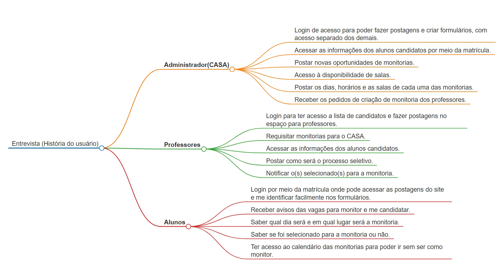
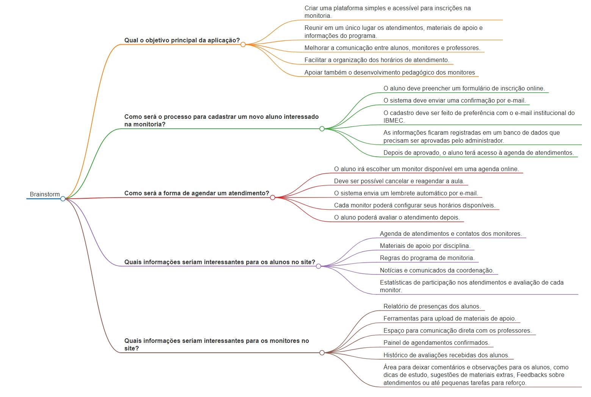

 
## Introdução
 

Mapa mental consiste em criar resumos cheios de símbolos, cores, setas e frases de efeito com o objetivo de organizar o conteúdo e facilitar associações entre as informações destacadas. Esse material é muito indicado para pessoas que têm facilidade de aprender de forma visual.

 
## Metodologia
 

Foi levantado um ponto importante sobre o app e, assim, foi produzido o mapa mental. O documento foi produzido utilizando a ferramenta Markmap e o aplicativo VS code, Além do brainstorm e entrevista realizada pela equipe.

 
## Mapa mental - Geral.
 
## Versão 1.0
 
### Mapa mental da Entrevista:
 

 
 
### Mapa mental do Brainstorm:
 

 
## Conclusão
 

O mapa mental é uma ficha de estudos que ajuda a dar uma visão geral do tema, e ajuda a fixar os pontos mais importantes sobre o app. Além de auxiliar na organização e divisões de tarefas entre a equipe responsavél.

 
## Referências
> <a href="http://127.0.0.1:5500/docs/design-thinking/mapabrainstorm.html" target="_blank">Mapa do Brainstorm</a>

> <a href="mapaEntrevista.md" target="_blank">Mapa da Entrevista</a>
 
> <a href="https://markmap.js.org" target="_blank">Markmap</a>

