## Introdução

A construção do protótipo de baixa fidelidade auxilia a equipe de desenvolvimento a encontrar um nível de detalhes abrangentes, extrair funcionalidades, testar usabilidade, e também fornece uma base para o gerenciamento do projeto pois com o protótipo é possível realizar estimativas sobre a funcionalidade do site preterido.

## Metodologia

Para iniciarmos o protótipo, utilisamos o PlantUml para gerar imagens de referência para entendermos as funcionalidades de cada página que deverá ser desenvolvida com base nas Histórias de Usuário, atendendo as necessidades dos mesmos.

## Protótipo de baixa fidelidade

### Versão 1.0

### Tela Inicial

Aqui o usuário pode selecionar seu modo.

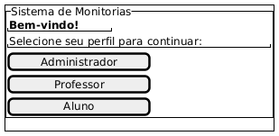

### Tela Cadastro 1

Nesta tela, o usuário faz seu cadastro. Ela é comum a todos.

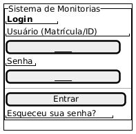

### Tela Esqueceu Senha

Em casos de esquecimento de senha, o usuário será transferido para essa tela.

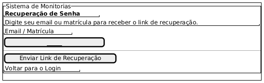

### Tela Feed

Essa é a tela central do aplicativo, onde as funcionalidades estarão disponíveis para o usuário. As telas de feed irão ser diferenciadas para cada tipo de usuário.

Administrador:

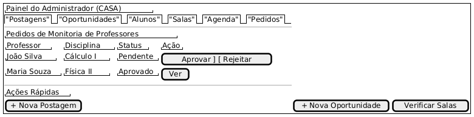

Professor:

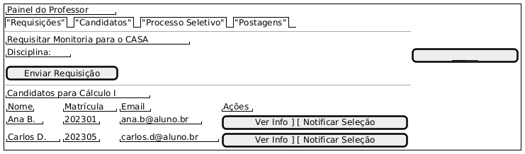

Aluno:

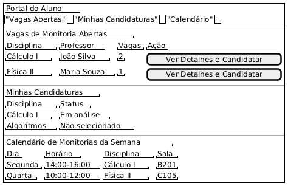

### Tela Configurações

Ao acessar as opções de configurações, essas serão as funcionalidades.

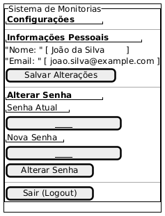

### Tela Detalhes 

Na tela de detalhes o usuário poderá saber mais sobre a monitoria.

Informação geral:

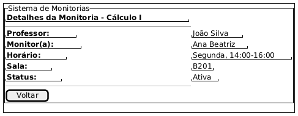

Administrador:

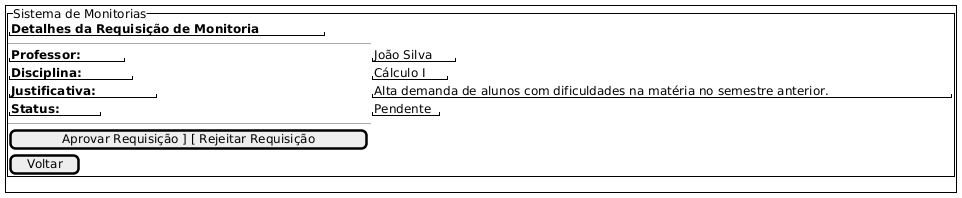

Aluno:

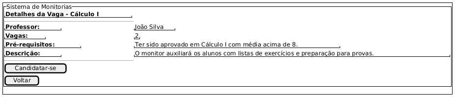

Professor:

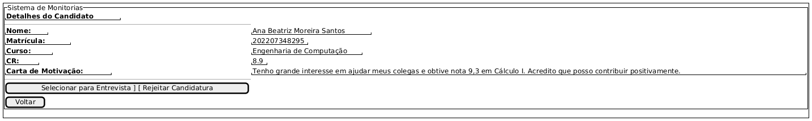

### Tela Inscrição de nova monitoria

Para que uma nova monitoria seja inscrita, o professor acessará esta tela.

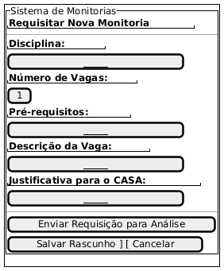

### Versão 2.0

Em breve!

## Conclusão

A partir da elaboração do protótipo foi possível ter uma noção inicial da interface do usuário, definindo fluxo, botões e outras funcionalidades básicas.

## Autor(es)

| Data     | Versão | Descrição                                  | Autor(es)                                                                            |
| -------- | ------- | --------------------------------------    | ------------------------------------------------------------------------------------ |
| 25/09/25 | 1.0     | Criação do documento                      | Giovanna Perrone                                                                     |
| 25/09/25 | 1.1     | Adicionado as imagens do protótipo        | Giovanna Perrone                                                                     |
| 29/09/25 | 1.2     | Adicionado conclusão e ajustando imagens  | Giovanna Perrone                                                                     |
