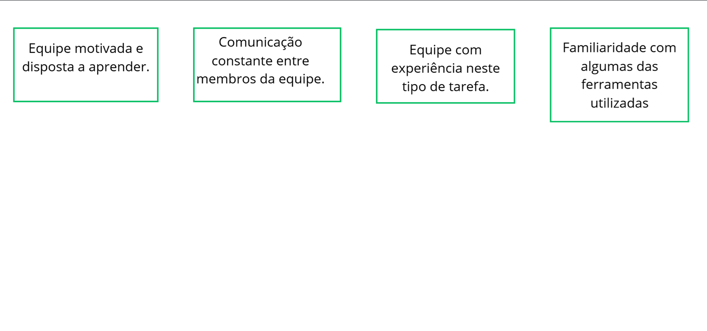
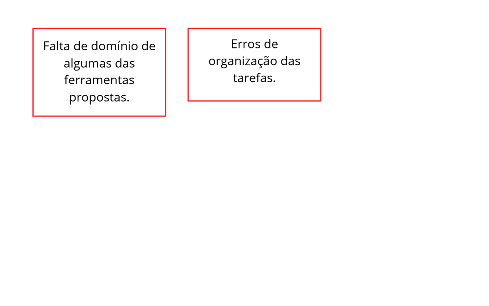
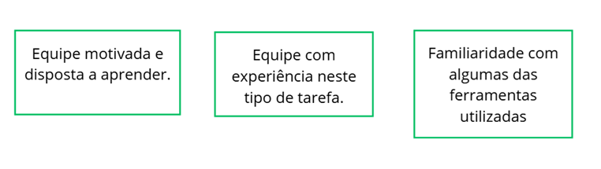

# Sprint I 

> 24/09/25 à 01/10/2025

## Planejamento de Interação

* **Presentes na reunião:** 

|Nome Completo | Matrícula|
|----|----|
|Matheus de Andrade Alvarenga| 202501001483|
|Rafael Tomaz da Silva Ribeiro| 202503545189|
|Maria Eduarda Perpetuo Lopes dos Santos| 202501001262|
|Giovanna Gomes Perrone| 202504193111|
|Julia Valente D’Alessandro| 202501000673|

## Objetivo da Sprint

- Definir a identidade inical do Projeto.
- Selecionar metodologias adaquedas para o desenvolvimento.
- Produzir documentos de apio para guiar o time.
- Aplicar técnicas de Design Thiking para levantar ideias e estrutura soluções.
- Criar prototipação de Baixa fidelidade para validar a proposta inical do sistema.

### Lista de Tarefas da Interação

|Tarefa|Responsabilidade|
|---|----|
| Decidir o nome o projeto.| Projeto CASA de Monitoria|
| Criar o repositório nos padrões (Organizar wiki).| Matheus Alvarenga|
| Criar issues no GitHub / ZenHub| Rafael Tomaz e Matheus Alvarenga|
| Estudar e escolher as metodologias.| Todos|
| [Documento de visão](https://github.com/xxx/xxx.md) |Rafael Tomaz|
| Elaborar [5w2H](https://github.com/xxx/xxx.md) |Matheus Alvarenga|
| [Mapas Mentais](https://github.com/xxx/xxx.md) |Maria Eduarda Perpetuo|
| [Brainstorming](https://github.com/XXXx) |Julia Valente D'Alessandro|
|[Entrevistas](https://github.com/xxx/xxx.md) |Maria Eduarda Perpetuo e Giovanna Perrone|
|[Prototipação.](https://github.com/xxx/xxx.md) |Giovanna Perrone|

### Criterios de Qualidade

Um item só é considerado "Pronto" quando:

- Como organizar a equipe de forma que todos podem dispor do seu máximo potencial.
- Abstrair e focar apenas nas partes importantes do projeto no momento.
- Alterar os documentos do trabalho sem que interfira na parte que é responsabilidade de outros membros do grupo.
- Aprender como funciona as ferramentas de atualização do site e dominá-las.

### Sprint Review

-

#### Pontos Positivos

- Equipe motivada, dedicada e com boa comunicação.
- Equipe organizada com antecedência.
- Ideias levantadas no brainstorm trouxeram soluções criativas para funcionalidades futuras e informações importantes.
- Equipe já tem um bom domínio das ferramnetas, então as partes são feitas com uma maior efetividade.
- O projeto progrediu mais rapidamente do que nas ultimas semanas.

#### Pontos Negativos

- Como a equipe ainda está em processo de adaptação ao fluxo de trabalho e às ferramentas, a velocidade de desenvolvimento foi menor, mas tende a melhorar nas próximas sprints.
- Algumas dificuldades em relação á atualização do site.
- Erros de cominucação na equipe em relação ao andamento do projeto.

#### O que podemos melhorar?

- Ter mais foco na reuniões para evitar o desperdício de tempo.
- A equipe deve ter mais autonomia em relação à falta de membros.
- Utilização mais ativamente o Scrum  para uma melhor comunicação e troca na equipe.
- Estudar as ferramentas de forma que todos se ajudem e aprendam juntos, pois assim melhora as relações interpessoais além de ser comprovadamente uma maneira mais efetiva de aprendizado.
- Uma melhor comunicação entre os membros da equipe.
- Uma melhor organização do tempo da equipe.
- Podemos utilizar algo ferramenta de timebox para maior efetividade nas reuniões, sugestão: 

#### Ferramentas utilizadas

- Reunião: [Hangouts](https://hangouts.google.com/)
- Colheita dos pontos: [Mentimeter](https://www.mentimeter.com/)
- Protótipo: [Salt(Plantuml)](https://www.plantuml.com/plantuml/uml/SoWkIImgAStDuU8gJimfuQhcugnMvkBaTCxFCQm14aP0ThH2R4rGVhb2Ic998XTdBLSj5vT3QbuAK1C0) 

# Sprint II 

> 01/10/25 à 22/10/2025

## Objetivo da Sprint

Iniciar a criação do site de monitorias.

### Itens escolhidos do backlog

-

|Nome Completo | Matrícula|
|----|----|
|Matheus de Andrade Alvarenga| 202501001483|
|Rafael Tomaz da Silva Ribeiro| 202503545189|
|Maria Eduarda Perpetuo Lopes dos Santos| 202501001262|
|Giovanna Gomes Perrone| 202504193111|
|Julia Valente D’Alessandro| 202501000673|

### Lista de Tarefas da Interação

Alteraçôes no quadro em breve!

|Tarefa|Responsabilidade|
|---|----|
| Decidir o nome o projeto.| Projeto CASA de Monitoria|
| Preparação do ambiente do repositório| Giovanna Perrone e Julia Valente|
| Designe do Site| Giovanna Perrone e Julia Valente|
| Criação das páginas baseadas na prototipação|Todos|
| Sprint 2 |Maria Eduarda Perpetuo|

### Critério de Qualidade

Um item só é considerado "Pronto" quando:

- Todas as páginas do prototipo estiverem prontas

### Sprint Review

- 
- 

### Pontos Positivos

- Equipe motivada e disposta a aprender.
- Equipe com experiência neste tipo de tarefa.
- Familiaridade com algumas das ferramentas utilizadas.
- Comunicação constante entre membros da equipe.

)

#### Pontos Negativos

- Falta de domínio de algumas das ferramentas propostas.
- Erros de organização das tarefas.

#### O que podemos melhorar?

- Dividir mais claramente a função de cada um.
- Estudar mais as ferramentas que são utilizadas.
- Criar um sistema de feedback entre os membros da equipe.

#### Ferramentas utilizadas

- Reunião: [Hangouts](https://hangouts.google.com/)
- Site: React, Java SCript, Css e node

# Sprint III 

> 22/10/25 à 29/10/2025

## Objetivo da Sprint

Continuar o desenvolvimento do site.

### Itens escolhidos do backlog

- Hitória do ALuno, do professor e do administrador

|Nome Completo | Matrícula|
|----|----|
|Matheus de Andrade Alvarenga| 202501001483|
|Rafael Tomaz da Silva Ribeiro| 202503545189|
|Maria Eduarda Perpetuo Lopes dos Santos| 202501001262|
|Giovanna Gomes Perrone| 202504193111|
|Julia Valente D’Alessandro| 202501000673|

### Lista de Tarefas da Interação
Alteraçôes no quadro em breve!

|Tarefa|Responsabilidade|
|---|----|
| Decidir o nome o projeto.| Projeto CASA de Monitoria|
| Atualização para UseState das páginas que faltaram| Matheus Alvarenga|
| Criar prototipos de baixa fidelidade| Giovanna Perrone e Maria Eduarda Perpetuo|
| Criar novas páginas do site| Giovanna Perrone, Julia Valente e Maria Eduarda Perpetuo|

### Critério de Qualidade

Um item só é considerado "Pronto" quando:

- Quando os novos prototipos e novas páginas estiverem prontas.

### Sprint Review

- Em relação ao apresentado semana passada, precisamos criar os prototipos das páginas que faltam e atualizar quatro páginas para o UseState.

### Pontos Positivos

- A equipe já tem uma maior habilidade com as ferramentas propostas.
- A equipe já tem experiência com as tarefas a ser feitas.
- Equipe motivada e disposta a aprender.

#### Pontos Negativos

- Pouca comunicação entre os membros da equipe em geral.

#### O que podemos melhorar?

- Melhorar comunicação entre os membros da equipe em geral.

#### Ferramentas utilizadas

- Reunião: [Hangouts](https://hangouts.google.com/)
- React
- Java Script
- HTML
# Sprint IV 

> 29/02/25 à 13/10/2025

## Objetivo da Sprint

XXXX XXXX XXXX

### Itens escolhidos do backlog

- 
- 

### Lista de Tarefas da Interação

|Tarefa|Responsabilidade|
|---|----|
| XXXX XXXX XXXX| XXXX|
| XXXX XXXX XXXX| XXXX|
| XXXX XXXX XXXX| XXXX|

### Critério de Qualidade

Um item só é considerado "Pronto" quando:

- 
- 

### Sprint Review

- 
- 

### Ferramentas Utilizadas

- Reunião: [Google Meet](https://meet.google.com/)

# Sprint V 

> 29/02/25 à 13/10/2025

## Objetivo da Sprint

XXXX XXXX XXXX

### Itens escolhidos do backlog

- 
- 

### Lista de Tarefas da Interação

|Tarefa|Responsabilidade|
|---|----|
| XXXX XXXX XXXX| XXXX|
| XXXX XXXX XXXX| XXXX|
| XXXX XXXX XXXX| XXXX|

### Critério de Qualidade

Um item só é considerado "Pronto" quando:

-
-

### Sprint Review

-
-

### Ferramentas Utilizadas

- Reunião: [Google Meet](https://meet.google.com/)
