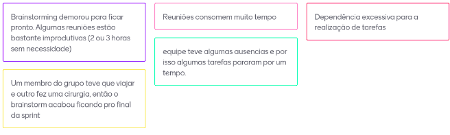

# Sprint I 

> 24/09/25 à 01/10/2025

## Planejamento de Interação

* **Presentes na reunião:** 

|Nome Completo | Matrícula|
|----|----|
|Matheus de Andrade Alvarenga| 202501001483|
|Rafael Tomaz da Silva Ribeiro| 202503545189|
|Maria Eduarda Perpetuo Lopes dos Santos| 202501001262|
|Giovanna Gomes Perrone| 202504193111|
|Julia Valente D’Alessandro| 202501000673|

### Lista de Tarefas da Interação

|Tarefa|Responsabilidade|
|---|----|
| Decidir o nome o projeto.| Projeto CASA de Monitoria|
| Criar o repositório nos padrões (Organizar wiki).| Matheus Alvarenga|
| Criar issues no GitHub / ZenHub| Rafael Tomaz e Matheus Alvarenga|
| Estudar e escolher as metodologias.| Todos|
| [Documento de visão](https://github.com/xxx/xxx.md) |XXX e XXXXX|
| Elaborar [5w2H](https://github.com/xxx/xxx.md) |Matheus Alvarenga|
| [Mapas Mentais](https://github.com/xxx/xxx.md) |Maria Eduarda Perpetuo|
| [Brainstorming](https://github.com/XXXx) |Julia Valente D'Alessandro|
|[Entrevistas](https://github.com/xxx/xxx.md) |Maria Eduarda Perpetuo e Giovanna Perrone|
|[Prototipação.](https://github.com/xxx/xxx.md) |Giovanna Perrone|

### Sprint Retrospective/Review Meeting

#### Dúvidas da Interação

- Como organizar a equipe de forma que todos podem dispor do seu máximo potencial.
- Abstrair e focar apenas nas partes importantes do projeto no momento.
- Alterar os documentos do trabalho sem que interfira na parte que é responsabilidade de outros membros do grupo.
- Aprender como funciona as ferramentas de atualização do site e dominá-las.

#### Riscos Encontrados

- Nenhum: Plano de gerenciamento de riscos não implementado.

#### Pontos Positivos

- Equipe motivada, dedicada e com boa comunicação.
- Equipe organizada com antecedência.
- Ideias levantadas no brainstorm trouxeram soluções criativas para funcionalidades futuras e informações importantes.
- Equipe já tem um bom domínio das ferramnetas, então as partes são feitas com uma maior efetividade.
- O projeto progrediu mais rapidamente do que nas ultimas semanas.

#### Pontos Negativos

- Como a equipe ainda está em processo de adaptação ao fluxo de trabalho e às ferramentas, a velocidade de desenvolvimento foi menor, mas tende a melhorar nas próximas sprints.
- Algumas dificuldades em relação á atualização do site.
- Erros de cominucação na equipe em relação ao andamento do projeto.

#### O que podemos melhorar?

- Ter mais foco na reuniões para evitar o desperdício de tempo.
- A equipe deve ter mais autonomia em relação à falta de membros.
- Utilização mais ativamente o Scrum  para uma melhor comunicação e troca na equipe.
- Estudar as ferramentas de forma que todos se ajudem e aprendam juntos, pois assim melhora as relações interpessoais além de ser comprovadamente uma maneira mais efetiva de aprendizado.
- Uma melhor comunicação entre os membros da equipe.
- Uma melhor organização do tempo da equipe.
- Podemos utilizar algo ferramenta de timebox para maior efetividade nas reuniões, sugestão: 

#### Ferramentas utilizadas

- Reunião: [Hangouts](https://hangouts.google.com/)
- Colheita dos pontos: [Mentimeter](https://www.mentimeter.com/)
- Protótipo: [Salt(Plantuml)](https://www.plantuml.com/plantuml/uml/SoWkIImgAStDuU8gJimfuQhcugnMvkBaTCxFCQm14aP0ThH2R4rGVhb2Ic998XTdBLSj5vT3QbuAK1C0) 

# Sprint II 

> 01/10/25 à 15/10/2025

 Em breve!

## Planejamento de Interação

* **Presentes na reunião:** 

|Nome Completo | Matrícula|
|----|----|
|Matheus de Andrade Alvarenga| 202501001483|
|Rafael Tomaz da Silva Ribeiro| 202503545189|
|Maria Eduarda Perpetuo Lopes dos Santos| 202501001262|
|Giovanna Gomes Perrone| 202504193111|
|Julia Valente D’Alessandro| 202501000673|

### Lista de Tarefas da Interação

Alteraçôes no quadro em breve!

|Tarefa|Responsabilidade|
|---|----|
| Decidir o nome o projeto.| Projeto CASA de Monitoria|
| Criar o repositório nos padrões (Organizar wiki).| Matheus Alvarenga|
| Criar issues no GitHub / ZenHub| Rafael Tomaz e Matheus Alvarenga|
| Estudar e escolher as metodologias.| Todos|
| [Documento de visão](https://github.com/xxx/xxx.md) |XXX e XXXXX|
| Elaborar [5w2H](https://github.com/xxx/xxx.md) |Matheus Alvarenga|
| [Mapas Mentais](https://github.com/xxx/xxx.md) |Maria Eduarda Perpetuo|
| [Brainstorming](https://github.com/XXXx) |Julia Valente D'Alessandro|
|[Entrevistas](https://github.com/xxx/xxx.md) |Maria Eduarda Perpetuo e Giovanna Perrone|
|[Prototipação.](https://github.com/xxx/xxx.md) |Giovanna Perrone|

### Sprint Retrospective/Review Meeting

#### Dúvidas da Interação

- Em breve!

#### Riscos Encontrados

- Nenhum: Plano de gerenciamento de riscos não implementado.

#### Pontos Positivos

- Equipe motivada, dedicada e com boa comunicação.
- Boa organização de funções e constantes feedbacks.

#### Pontos Negativos

- Em breve!

#### O que podemos melhorar?

- Em breve!

#### Ferramentas utilizadas

- Reunião: [Hangouts](https://hangouts.google.com/)
- Colheita dos pontos: [Mentimeter](https://www.mentimeter.com/)

# Sprint III 

> 15/10/25 à 22/10/2025

Em breve!

## Planejamento de Interação

* **Presentes na reunião:** 

|Nome Completo | Matrícula|
|----|----|
|Matheus de Andrade Alvarenga| 202501001483|
|Rafael Tomaz da Silva Ribeiro| 202503545189|
|Maria Eduarda Perpetuo Lopes dos Santos| 202501001262|
|Giovanna Gomes Perrone| 202504193111|
|Julia Valente D’Alessandro| 202501000673|

### Lista de Tarefas da Interação
Alteraçôes no quadro em breve!

|Tarefa|Responsabilidade|
|---|----|
| Decidir o nome o projeto.| Projeto CASA de Monitoria|
| Criar o repositório nos padrões (Organizar wiki).| Matheus Alvarenga|
| Criar issues no GitHub / ZenHub| Rafael Tomaz e Matheus Alvarenga|
| Estudar e escolher as metodologias.| Todos|
| [Documento de visão](https://github.com/xxx/xxx.md) |XXX e XXXXX|
| Elaborar [5w2H](https://github.com/xxx/xxx.md) |Matheus Alvarenga|
| [Mapas Mentais](https://github.com/xxx/xxx.md) |Maria Eduarda Perpetuo|
| [Brainstorming](https://github.com/XXXx) |Julia Valente D'Alessandro|
|[Entrevistas](https://github.com/xxx/xxx.md) |Maria Eduarda Perpetuo e Giovanna Perrone|
|[Prototipação.](https://github.com/xxx/xxx.md) |Giovanna Perrone|

### Sprint Retrospective/Review Meeting

#### Dúvidas da Interação

- Em breve.

#### Riscos Encontrados

- Nenhum: Plano de gerenciamento de riscos não implementado.

#### Pontos Positivos

- Em breve.

#### Pontos Negativos

- Em breve!

#### O que podemos melhorar?

- Em breve.

#### Ferramentas utilizadas

- Reunião: [Hangouts](https://hangouts.google.com/)
- Colheita dos pontos: [Mentimeter](https://www.mentimeter.com/)

# Sprint IV 

> 10/02/25 à 07/04/2025

## Planejamento de Interação

* **Presentes na reunião:** 

|Nome|----|
|----|----|
|XXXX Xxxxx Xxxxx|----|
|XXXX Xxxxx Xxxxx|----|

### Lista de Tarefas da Interação

|Tarefa|Responsabilidade|
|---|----|
| Decidir o nome o projeto.|Todos|
| Criar o repositório nos padrões (Organizar wiki).| xxxxx|
| Criar issues no GitHub / ZenHub| xxxx|
| Estudar e escolher as metodologias.| Todos|
| [Documento de visão](https://github.com/xxx/xxx.md) |XXX e XXXXX|
| Elaborar [5w2H](https://github.com/xxx/xxx.md) |XXX e XXXXX|
| [Mapas Mentais](https://github.com/xxx/xxx.md) |XXX e XXXXX|
| [Brainstorming](https://github.com/XXXx) |Todos|
|[Entrevistas](https://github.com/xxx/xxx.md) |XXX e XXXXX|
|[Prototipação.](https://github.com/xxx/xxx.md) |XXX e XXXXX|

### Sprint Retrospective/Review Meeting

#### Dúvidas da Interação

- 1
- 2

#### Riscos Encontrados

- Nenhum: Plano de gerenciamento de riscos não implementado.

#### Pontos Positivos

- 1
- 2

#### Pontos Negativos

- 1
- 2
- 3

#### O que podemos melhorar?

- Ter mais foco na reuniões para evitar o desperdício de tempo.
- A equipe deve ter mais autonomia em relação à falta de membros.
- Podemos utilizar algo ferramenta de timebox para maior efetividade nas reuniões, sugestão: 

#### Ferramentas utilizadas

- Reunião: [Hangouts](https://hangouts.google.com/)
- Colheita dos pontos: [Mentimeter](https://www.mentimeter.com/)

# Sprint V 

> 10/02/25 à 07/04/2025

## Planejamento de Interação

* **Presentes na reunião:** 

|Nome|----|
|----|----|
|XXXX Xxxxx Xxxxx|----|
|XXXX Xxxxx Xxxxx|----|

### Lista de Tarefas da Interação

|Tarefa|Responsabilidade|
|---|----|
| Decidir o nome o projeto.|Todos|
| Criar o repositório nos padrões (Organizar wiki).| xxxxx|
| Criar issues no GitHub / ZenHub| xxxx|
| Estudar e escolher as metodologias.| Todos|
| [Documento de visão](https://github.com/xxx/xxx.md) |XXX e XXXXX|
| Elaborar [5w2H](https://github.com/xxx/xxx.md) |XXX e XXXXX|
| [Mapas Mentais](https://github.com/xxx/xxx.md) |XXX e XXXXX|
| [Brainstorming](https://github.com/XXXx) |Todos|
|[Entrevistas](https://github.com/xxx/xxx.md) |XXX e XXXXX|
|[Prototipação.](https://github.com/xxx/xxx.md) |XXX e XXXXX|

### Sprint Retrospective/Review Meeting

#### Dúvidas da Interação

- 1
- 2

#### Riscos Encontrados

- Nenhum: Plano de gerenciamento de riscos não implementado.

#### Pontos Positivos

- 1
- 2

#### Pontos Negativos

- 1
- 2
- 3

#### O que podemos melhorar?

- Ter mais foco na reuniões para evitar o desperdício de tempo.
- A equipe deve ter mais autonomia em relação à falta de membros.
- Podemos utilizar algo ferramenta de timebox para maior efetividade nas reuniões, sugestão: 

#### Ferramentas utilizadas

- Reunião: [Hangouts](https://hangouts.google.com/)
- Colheita dos pontos: [Mentimeter](https://www.mentimeter.com/)